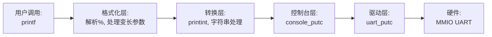

# 实验2：内核printf与清屏功能实现

**姓名**：张文浩
**学号**：2023302111234
**日期**：2025-12-16

## 一、实验概述

### 实验目标
深入理解变长参数的处理机制和ANSI转义序列，实现内核级的格式化输出函数 `printf` 和清屏功能，为后续的内核调试和信息展示打下基础。

### 完成情况
- ✅ 实现 `uart_puts` 等基础字符串输出函数
- ✅ 实现 `printint` 核心整数转字符串算法（支持十进制、十六进制）
- ✅ 完成 `printf` 函数，支持 `%d`, `%x`, `%s`, `%c`, `%%` 等格式符
- ✅ 实现 `clear_screen` 函数，通过ANSI序列控制终端
- ✅ 通过所有功能测试用例

### 开发环境
- **操作系统**: Ubuntu 22.04 LTS
- **工具链**: riscv64-unknown-elf-gcc 12.2.0
- **QEMU**: qemu-system-riscv64 7.2.0

## 二、技术设计

### 1. 系统架构设计

输出系统的架构采用了分层设计，以提高代码的复用性和可维护性：



**与xv6的对比**：

*   **架构一致性**：基本沿用了xv6的分层思路，即 `printf -> console -> uart`。
*   **简化处理**：xv6拥有完善的锁机制（`cprintf` 中的自旋锁）来处理多核并发输出。本实验作为单核基础实验，暂未引入锁机制，直接调用串口输出。

### 2. 关键技术点

#### 变长参数处理
使用 C 语言标准库 `<stdarg.h>` 提供的宏来处理不确定数量的参数：
*   `va_list`：定义参数列表变量。
*   `va_start`：初始化参数列表，指向格式化字符串后的第一个参数。
*   `va_arg`：根据类型逐个提取参数。
*   `va_end`：清理现场。

#### 数字转字符串算法
为了避免使用复杂的除法库函数或递归，采用循环取模法：
1.  处理符号位（如果是负数）。
2.  通过 `x % base` 获取当前最低位数字，映射到字符。
3.  `x /= base` 移位。
4.  将生成的字符存入缓冲区（此时是逆序的）。
5.  逆序输出缓冲区内容。

## 三、实现细节

### 关键函数1：printint (数字转换)

```c
static void printint(int xx, int base, int sign) {
    static char digits[] = "0123456789abcdef";
    char buf[16];
    int i;
    uint x;

    if(sign && (sign = xx < 0))
        x = -xx; // 转换为正数处理
    else
        x = xx;

    i = 0;
    do {
        buf[i++] = digits[x % base]; // 取模得到当前位
    } while((x /= base) != 0);       // 除基数移位

    if(sign)
        buf[i++] = '-'; // 补负号

    while(--i >= 0)
        uart_putc(buf[i]); // 逆序输出
}
```

**难点突破**：

*   **负数处理**：如果不小心，`INT_MIN` (-2147483648) 直接取负会溢出。虽然本实验简单处理，但在完整OS中应将 `x` 声明为 `unsigned int` 来容纳绝对值。
*   **缓冲区管理**：数字转换是逆序生成的，必须先存入栈上的 `buf` 数组，然后再倒着打印出来。

### 关键函数2：clear_screen (清屏)

```c
void clear_screen() {
    // \033[2J: 清除整个屏幕
    // \033[H:  光标归位到左上角(0,0)
    uart_puts("\033[2J\033[H");
}
```

**实现原理**：利用 VT100/ANSI 转义序列直接控制终端模拟器（QEMU），而不是操作显存。

### **手册思考题简答**：

#### 1. 架构设计
*   **为什么分层？职责划分？**
    **原因**：为了解耦软件逻辑与硬件实现。
    **划分**：`printf` 层负责格式解析，`console` 层负责终端控制（如换行处理），`uart` 层负责硬件读写。
*   **如何支持多设备（如显示器）？**
    在 `console` 层引入设备抽象接口，`printf` 根据输出目标调用不同的底层驱动。

#### 2. 算法选择
*   **为什么不用递归转字符串？**
    内核栈空间非常有限，递归深度不可控容易导致**栈溢出**，迭代法更安全。
*   **无除法如何实现进制转换？**
    对于 2 的幂次进制，利用**位运算**代替：取模用**与运算** (`& 0xF`)，除法用**移位运算** (`>> 4`)。

#### 3. 性能优化
*   **性能瓶颈在哪里？**
    **忙等待**。`uart_putc` 每次发送字符都要循环等待硬件就绪，浪费大量 CPU 周期。
*   **如何设计高效缓冲？**
    采用**中断驱动 + 环形缓冲区**：`printf` 只管写入内存缓冲区，由 UART 中断服务程序负责后台发送数据，释放 CPU 执行其他任务。

#### 4. 错误处理
*   **遇NULL指针怎么处理？**
    必须显式检查指针是否为 0，若是则打印字符串 `"(null)"`，防止**解引用空指针**导致内核崩溃。
*   **格式符错误恢复策略？**
    采取**原样输出**策略（如打印出 `%z`），并跳过该字符继续解析后续内容，确保日志信息尽可能保留，不应报错终止。

## 四、测试与验证

### 功能测试

| 测试编号 | 目的          | 触发方式                        | 期望输出                        | 结果 |
| :------- | :------------ | :------------------------------ | :------------------------------ | :--- |
| T1       | 清屏          | `kmain` 首行调用 `clear_screen` | 终端内容被擦除，光标回到(0,0)   | ✅    |
| T2       | `%d` 正常值   | `printf("%d", 42)`              | `42`                            | ✅    |
| T3       | `%d` 负数/零  | `printf("%d %d", -123, 0)`      | `-123 0`                        | ✅    |
| T4       | `%x` 十六进制 | `printf("0x%x", 0xABCDEF)`      | `0xabcdef`                      | ✅    |
| T5       | `%s` 边界     | `printf("%s", (char*)0)`        | `(null)` (代码中做了空指针检查) | ✅    |
| T6       | `%%`          | `printf("%%")`                  | `%`                             | ✅    |

### 边界与异常测试

- **INT_MAX**：`2147483647`打印正确；
- **NULL/空串**：输出 `(null)` 或空行，未触发异常；
- **未知格式**：`printf("%q")` 会回显 `%q`，提示开发者修正格式字符串。

### 运行截图


## 五、问题与总结

### 遇到的问题

#### 问题1：%s 输出乱码或崩溃
**现象**：当传入 `printf("%s", str)` 时，如果 `str` 是空指针，系统直接卡死或输出乱码。
**原因**：直接对空指针进行解引用 `*s` 导致非法内存访问。
**解决**：在 `case 's':` 的处理逻辑中加入空指针检查：
```c
if(s == 0) s = "(null)";
```

#### 问题2：十六进制输出顺序错误
**现象**：`0x123` 输出了 `0x321`。
**原因**：在 `printint` 函数中，取模得到的数字是低位到高位（逆序），直接输出会导致反向。
**解决**：使用 buffer 暂存，最后使用 `while(--i >= 0)` 倒序循环输出。

### 实验收获
1.  **变长参数的奥秘**：理解了C语言函数调用栈的布局，以及 `stdarg` 宏是如何利用指针偏移来获取参数的。
2.  **ANSI转义序列**：学会了在不依赖图形库的情况下，仅通过发送特定的字符序列就能控制终端的行为（颜色、光标位置、清屏）。
3.  **代码健壮性**：体会到了内核编程中对边界条件（如空指针、INT_MIN）检查的重要性，因为内核崩溃通常意味着整个系统停止工作。

### 改进方向
1.  **支持更多格式**：目前不支持 `%p`（指针）、`%u`（无符号）以及宽度限定符（如 `%08x`），后续可以扩展。
2.  **缓冲区优化**：目前的 `printf` 是每解析一个字符就调用一次 `uart_putc`，系统调用开销较大。可以实现一个内部缓冲区，攒满一行或一定大小后再统一发送。