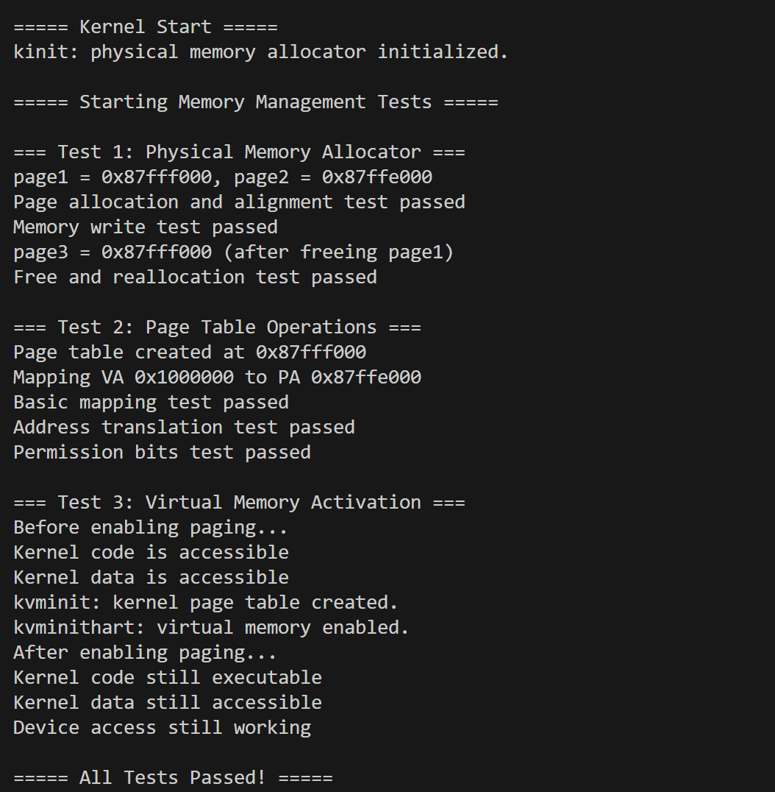

# 实验3：页表与内存管理

**姓名**：
**学号**：
**日期**：2025-12-16

## 一、实验概述

### 实验目标
深入理解RISC-V Sv39虚拟内存机制，实现物理内存分配器和多级页表管理系统，最终完成内核空间的地址映射并开启分页模式。

### 完成情况
- ✅ 实现 `kalloc.c`：物理内存的链表式管理（分配与释放）
- ✅ 实现 `vm.c` 中的 `walk` 函数：模拟MMU进行三级页表遍历
- ✅ 实现 `mappages`：建立虚拟地址到物理地址的映射
- ✅ 实现 `kvminit`：构建内核页表（恒等映射）
- ✅ 实现 `kvminithart`：写入SATP寄存器并开启虚拟内存

### 开发环境
- **操作系统**: Ubuntu 22.04 LTS
- **工具链**: riscv64-unknown-elf-gcc 12.2.0
- **QEMU**: qemu-system-riscv64 7.2.0

## 二、技术设计

### 1. 系统架构设计

内存管理系统分为两层：


*   **物理层**：负责管理物理页面的空闲链表，提供 `alloc` 和 `free` 接口。
*   **虚拟层**：负责维护页表结构，处理虚拟地址到物理地址的映射关系，设置读写执行（RWX）权限。

与xv6 的主要异同：

| 模块                   | xv6 行为                                            | 本实验取舍                                                   |
| ---------------------- | :-------------------------------------------------- | ------------------------------------------------------------ |
| 物理分配               | 伴随 kmem.lock 自旋锁支持多核；kfree 时填充垃圾数据 | 仅单核，省略锁；但在 kalloc 时**清零**内存，增强安全性防止信息泄露 |
| **页表遍历** (walk)    | 逻辑通用，支持判断大页映射                          | 仅关注标准 **4KB 页**；按需分配中间级页表；不支持大页        |
| **内核映射** (kvminit) | 使用结构体数组循环映射多种外设                      | **显式逐行调用** mappages；只映射 UART/代码段/数据段，逻辑路径更清晰 |

### 2. 关键数据结构

#### 空闲链表节点 (`kalloc.c`)
```c
struct run {
    struct run *next;
};
```
**设计理由**：直接利用空闲的物理页本身存储链表指针。当一个页空闲时，它的前8个字节存储指向下一个空闲页的地址。这样不需要额外的内存开销来管理空闲页。

#### 页表项宏定义 (`riscv.h`)
```c
#define PTE_V (1L << 0) // Valid
#define PTE_R (1L << 1) // Read
#define PTE_W (1L << 2) // Write
#define PTE_X (1L << 3) // Execute
#define PA2PTE(pa) ((((uint64)pa) >> 12) << 10)
#define PTE2PA(pte) (((pte) >> 10) << 12)
```
**设计理由**：严格遵循RISC-V Sv39规范。物理地址存储在PTE的高54位（右移10位），低10位用于标志位。

### 3. 核心算法与流程

#### (1) 核心流程：物理内存分配与释放

采用**空闲链表法 ** 管理物理内存。

*   **分配流程 (`kalloc`)**：
    1.  检查全局指针 `freelist` 是否为空。
    2.  若为空，返回 `NULL`（内存耗尽）。
    3.  若非空，取链表头节点 `r = freelist`。
    4.  更新头指针 `freelist = r->next`。
    5.  **关键步骤**：执行 `memset(r, 0, PGSIZE)` 将页面清零，防止数据残留。
    6.  返回物理地址 `r`。

*   **释放流程 (`kfree`)**：
    1.  **边界检查**：检查地址是否页对齐、是否在物理内存范围内 (`end` ~ `PHYSTOP`)。
    2.  **数据销毁**：将页面内容填充为垃圾数据，辅助调试 Use-after-free 错误。
    3.  **头插法**：将当前页强转为 `struct run*`，令 `r->next = freelist`。
    4.  更新全局指针 `freelist = r`。

#### (2) 重要的技术选择与边界处理

1.  **映射策略选择**：
    *   **恒等映射 **：在内核页表中，虚拟地址 `0x80000000` 直接映射到物理地址 `0x80000000`。
    *   **理由**：简化了内核直接访问物理内存和外设寄存器（如UART）的逻辑，避免了在内核态还需要进行复杂的地址转换计算。

2.  **边界情况处理**：
    *   **地址对齐**：在 `kfree` 中严格检查 `pa % PGSIZE == 0`，防止释放非页对齐的地址导致链表损坏。
    *   **内存越界**：在 `walk` 函数中，如果输入的虚拟地址超出了 Sv39 支持的最大范围（$2^{39}-1$），直接返回 0，防止索引溢出。
    *   **重复映射**：在 `map_page` 中，如果发现目标 PTE 已经有效（`PTE_V`为1），则打印警告并拒绝覆盖，防止内存泄漏。

## 三、实现细节

### 关键函数1：物理内存分配 (`kalloc`)

```c
void *kalloc(void) {
    struct run *r = freelist;
    if (r) {
        freelist = r->next;
        // 初始化为0，防止残留数据带来的安全隐患
        memset((char*)r, 0, PGSIZE); 
    }
    return (void*)r;
}
```

### 关键函数2：页表遍历 (`walk`)

```c
// 模拟MMU行为，查找虚拟地址va对应的PTE指针
static pte_t *walk(pagetable_t pagetable, uint64 va, int alloc) {
    if (va >= MAXVA) return 0;

    // 遍历 Level 2 -> Level 1
    for (int level = 2; level > 0; level--) {
        pte_t *pte = &pagetable[VPN(va, level)];
        if (*pte & PTE_V) {
            // 如果PTE有效，提取下一级页表的物理地址
            pagetable = (pagetable_t)PTE2PA(*pte);
        } else {
            // 如果PTE无效且不要求分配，直接返回
            if (!alloc || (pagetable = (pagetable_t)kalloc()) == 0)
                return 0;
            // 初始化新分配的页表页
            memset(pagetable, 0, PGSIZE);
            // 建立连接：指向新页表，并设置有效位
            *pte = PA2PTE(pagetable) | PTE_V;
        }
    }
    // 返回Level 0的PTE指针
    return &pagetable[VPN(va, 0)];
}
```

### 关键函数3：内核页表初始化 (`kvminit`)

```c
void kvminit(void) {
    kernel_pagetable = (pagetable_t)kalloc();
    memset(kernel_pagetable, 0, PGSIZE);

    // 1. 映射 UART (读写)
    mappages(kernel_pagetable, UART0, PGSIZE, UART0, PTE_R | PTE_W);
    
    // 2. 映射内核代码段 (读执行)
    mappages(kernel_pagetable, KERNBASE, (uint64)etext - KERNBASE, 
             KERNBASE, PTE_R | PTE_X);
             
    // 3. 映射内核数据段和自由内存 (读写)
    mappages(kernel_pagetable, (uint64)etext, PHYSTOP - (uint64)etext, 
             (uint64)etext, PTE_R | PTE_W);
}
```

### 难点突破

1.  **地址提取与位运算**：
    *   **难点**：Sv39使用三级页表，如何从64位虚拟地址中正确提取每一级的9位索引（VPN）？
    *   **解决**：定义宏 `#define VPN(va, level) (((uint64)(va) >> (12 + 9 * (level))) & 0x1FF)`。通过移位操作将对应的9位移到最低位，并用 `0x1FF` 掩码提取。

2.  **物理地址与PTE的转换**：
    *   **难点**：PTE中存储的物理页号（PPN）并不是直接的物理地址，且位置有偏移。
    *   **解决**：理解PTE格式。PTE的第10-53位是PPN。物理地址 = PPN * 4096。代码中使用 `((pte) >> 10) << 12` 完成转换。

3.  **恒等映射（Identity Mapping）的理解**：
    *   **难点**：为什么内核启用虚拟内存后，虚拟地址要等于物理地址？
    *   **解决**：内核在操作硬件或管理物理内存时，直接使用物理地址最方便。如果建立了 `VA=PA` 的映射，内核代码中的指针就可以直接对应物理内存，简化了内核设计，避免了复杂的地址翻译开销。

### 与xv6对比

*   **内存清零策略**：
    *   **xv6**：在 `kfree` 时将内存填充为垃圾数据（如1），用于尽早暴露 Use-after-free 的 bug。
    *   **本实验**：在 `kalloc` 时将内存清零 (`memset(..., 0, ...)`)。这是一种安全防御措施，防止新分配的进程读取到旧进程的残留数据。
*   **页表创建**：
    *   **xv6**：`walk` 函数逻辑严密，会在每一级检查分配结果。
    *   **本实验**：`kvminit` 中采用了更为简化的硬编码分段映射（UART段、Text段、Data段），而xv6通常使用一个结构体数组来遍历映射，本实验的方式更直观易懂。

### 手册思考题简答

#### 1. 设计对比
*   **与xv6有何不同？**
    xv6 和本实验通常都采用**空闲链表**管理物理页，利用空闲页本身存储 `next` 指针，不占用额外空间。
*   **设计权衡？**
    **优势**：实现简单，分配与释放时间复杂度均为 $O(1)$。
    **劣势**：内存碎片化严重，难以分配**连续**的物理多页。

#### 2. 内存安全
*   **如何防止恶意利用？**
    **内存清零**：在 `kalloc` 分配内存后立即使用 `memset` 清零，防止新进程读取到上一个进程残留的敏感数据（如密码）。
*   **页表权限安全考虑？**
    遵循 W^X 原则：代码段设为 `R|X`（不可写），数据段设为 `R|W`（不可执行），防止代码注入攻击。

#### 3. 性能分析
*   **性能瓶颈？**
    **页表遍历**。Sv39 机制下，一次虚拟地址访问可能需要 3 次物理内存读取（三级页表），依赖 **TLB** 缓存来加速。
*   **如何优化？**
    支持**大页**映射，减少页表层级和内存访问次数，同时大幅提高 TLB 命中率。

#### 4. 扩展性
*   **支持用户进程需修改什么？**
    需为每个进程分配**独立的页表**，并在页表中区分**用户空间**（低地址）和**内核空间**（高地址，仅映射 Trapframe 和 Trampoline）。
*   **如何实现写时复制（COW）？**
    将共享页面设为**只读**。当进程尝试写入时触发**缺页异常**，内核捕获后分配新物理页、复制数据、修改权限为可写，再恢复执行。

#### 5. 错误恢复
*   **创建失败如何清理？**
    在 `mappages` 或 `walk` 过程中若 `kalloc` 失败，必须执行**回滚**操作，释放掉为了此次映射已经分配的中间级页表页，防止内存泄漏。
*   **如何检测内存泄漏？**
    维护一个全局的**页分配计数器**（`alloc` +1，`free` -1），系统空闲时该计数器应归零或保持稳定。

## 四、测试与验证

### 功能测试

| 测试用例               | 关键断言                             | 结果 |
| :--------------------- | :----------------------------------- | :--- |
| `test_physical_memory` | 页对齐、写入读回、释放后可重用       | ✅    |
| `test_pagetable`       | `walk_lookup` 返回有效 PTE、权限 R/W | ✅    |
| `test_virtual_memory`  | 启用分页后代码/数据/UART 仍可访问    | ✅    |

### 运行截图



## 五、问题与总结

### 遇到的问题

#### 问题1：开启分页后立即崩溃
**现象**：执行 `w_satp` 指令后，QEMU报错 `Store/AMO page fault`。
**原因分析**：未正确建立内核栈的映射。当开启分页瞬间，PC指针还在物理地址空间，如果页表中没有对应的 `VA=PA` 映射，CPU 取指就会触发缺页异常。
**解决方法**：在 `kvminit` 中确保 `KERNBASE` 到 `PHYSTOP` 的所有区域都被覆盖映射。

#### 问题2：PTE权限设置错误
**现象**：映射代码段时使用了 `PTE_R | PTE_W`，导致后续无法执行代码。
**原因分析**：RISC-V的页表权限检查非常严格，如果PTE没有设置 `PTE_X`，则该页面不可被执行。
**解决方法**：将代码段的映射权限修改为 `PTE_R | PTE_X`。

### 实验收获
1.  **深入理解了多级页表**：通过亲手实现 `walk` 函数，基本弄懂了虚拟地址是如何一步步被拆分索引，最终找到物理页的过程。
2.  **物理与虚拟的桥梁**：理解了操作系统如何通过 `mappages` 将离散的物理内存“组装”成连续或特定布局的虚拟地址空间。
3.  **特权级硬件操作**：学会了如何操作 `satp` 寄存器和使用 `sfence.vma` 指令，这是用户态编程接触不到的底层领域。
