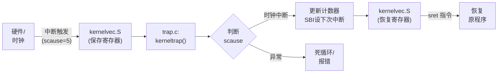
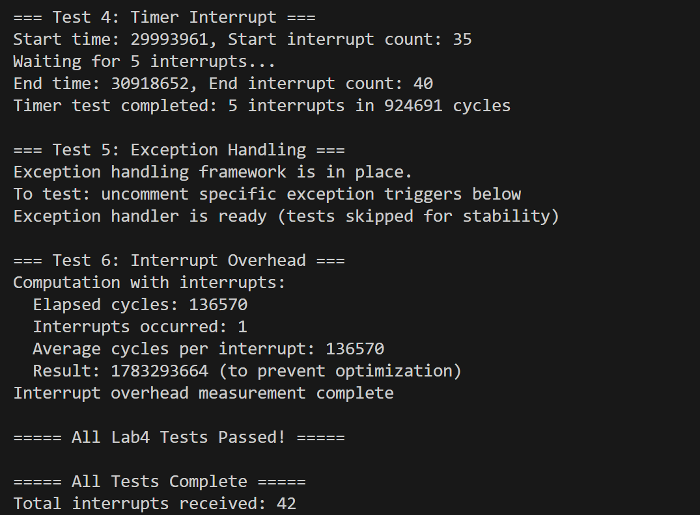

# 实验4：中断处理与时钟管理

**姓名**：
**学号**：
**日期**：2025-12-16

## 一、实验概述

### 实验目标
理解RISC-V架构的中断与异常处理机制，实现上下文保存与恢复的汇编代码，并通过OpenSBI接口实现时钟中断驱动，最终让内核具备“时间观念”和响应异步事件的能力。

### 完成情况
- ✅ 实现 `kernelvec.S`：上下文保存与恢复的汇编入口
- ✅ 实现 `trap.c`：中断分发与处理逻辑 (`kerneltrap`)
- ✅ 封装 SBI 调用：实现 `sbi_set_timer` 与 OpenSBI 交互
- ✅ 完成时钟初始化与测试：成功触发并处理周期性时钟中断

### 开发环境
- **操作系统**: Ubuntu 22.04 LTS
- **工具链**: riscv64-unknown-elf-gcc 12.2.0
- **QEMU**: qemu-system-riscv64 7.2.0

## 二、技术设计

### 1. 系统架构设计

中断处理流程遵循 "硬件触发 -> 汇编保存 -> C语言处理 -> 汇编恢复 -> 硬件返回" 的闭环结构：



### 2. 关键数据结构与寄存器

本实验主要涉及 RISC-V 特权级寄存器，在 `riscv.h` 中定义：

*   **`stvec` **：存储中断向量表的基地址。本实验将其指向 `kernelvec`。
*   **`scause` **：指示中断或异常发生的原因。最高位为1表示中断，低位为5表示 S-mode Timer Interrupt。
*   **`sepc` **：记录被中断指令的地址，`sret` 返回时使用。
*   **`sstatus` **：控制全局中断使能（SIE位）。

### 3. 核心流程：时钟中断驱动

RISC-V 的 `time` 寄存器在 S 模式下只读。要设置定时器，必须通过 SBI调用 M 模式的固件（OpenSBI）。

*   **初始化**：`clock_init` 读取当前时间，加上间隔 `INTERVAL`，通过 `sbi_set_timer` 设置下一次中断时刻，并开启 `sie` 寄存器的 `STIE` 位。
*   **处理周期**：每次进入 `kerneltrap` 处理时钟中断后，必须再次调用 `sbi_set_timer` 设置下一轮中断，否则时钟中断只会触发一次。

## 三、实现细节

### 关键函数1：上下文保存 (`kernelvec.S`)

```assembly
kernelvec:
    # 1. 在栈上分配空间 (32个寄存器 * 8字节 = 256字节)
    addi sp, sp, -256
    
    # 2. 保存所有通用寄存器 (callee-saved 和 caller-saved 都要保存)
    sd ra, 0(sp)
    sd sp, 8(sp)
    # ... (保存 gp, tp, t0-t6, s0-s11, a0-a7) ...
    sd t6, 240(sp)

    # 3. 调用C语言处理函数
    call kerneltrap

    # 4. 恢复寄存器
    ld ra, 0(sp)
    # ... (恢复所有寄存器) ...
    addi sp, sp, 256

    # 5. 特权级返回
    sret
```

### 关键函数2：中断分发逻辑 (`kerneltrap`)

```c
void kerneltrap() {
    uint64 scause = r_scause(); // 读取中断原因

    // 判断最高位是否为1 (中断) 且低位是否为5 (Timer)
    if ((scause & 0x8000000000000000L) && (scause & 0xff) == 5) {
        // 1. 响应中断，增加计数
        total_interrupt_count++;
        tick_counter++;
        
        // 2. 关键：设置下一次中断时间 (防止中断停止)
        uint64 next_timer = r_time() + 100000;
        sbi_set_timer(next_timer);
    } else {
        // 处理异常或未知中断
        printf("Unexpected trap: %p\n", scause);
        while(1);
    }
}
```

### 难点突破

1.  **SBI 接口调用**：
    *   **问题**：如何在 S 模式下设置 M 模式才有的 `mtimecmp` 寄存器？
    *   **解决**：查阅 RISC-V SBI 规范，使用 `ecall` 指令发起系统调用。Extension ID (`a7`) 为 0，Function ID (`a6`) 为 0 代表 `Set Timer`。
    *   **代码**：
        ```c
        register uint64 a7 asm("a7") = 0x00;
        register uint64 a6 asm("a6") = 0x00;
        asm volatile("ecall" : "+r"(a0) : "r"(a6), "r"(a7) : "memory");
        ```

2.  **上下文保存的完整性**：
    *   **问题**：中断处理通过 `call kerneltrap` 进入C代码，编译器会使用 `sp`, `ra`, `s0` 等寄存器。如果在进入C之前没有保存好这些寄存器，中断返回后原程序的栈帧和执行流就会被破坏。
    *   **解决**：在 `kernelvec.S` 中暴力保存了所有 32 个通用寄存器（除了 `zero`）。虽然有一定的性能开销，但保证了绝对的安全性。

### 与 xv6 的主要异同

| 模块         | xv6 实现                                            | 本实验实现                           | 差异分析                                                     |
| :----------- | :-------------------------------------------------- | :----------------------------------- | :----------------------------------------------------------- |
| **中断入口** | 分为 `uservec` (用户态) 和 `kernelvec` (内核态)     | 目前仅实现 `kernelvec`               | xv6 区分用户栈和内核栈的切换；本实验目前仅涉及内核态中断，直接在内核栈上保存上下文。 |
| **时钟驱动** | 在 `sys_start.c` 中通过 M 模式直接操作 `CLINT` 硬件 | 通过 **SBI 接口** 调用               | QEMU virt 平台更推荐使用 SBI 标准接口，兼容性更好，也符合 S 模式的权限规范。 |
| **异常处理** | 有完善的 `usertrap` 处理系统调用、缺页等            | 仅实现了最基本的 `while(1)` 异常捕获 | xv6 是完整的 OS，本实验处于构建初期，重点在于打通中断链路。  |

### 手册思考题简答：

#### 1. 中断设计
*   **为什么时钟中断要在M模式处理后委托给S模式？**
    **硬件限制**。RISC-V 标准规定时钟寄存器（`mtime`）是 **M模式** 特有资源。机制是：M模式响应硬件时钟中断 -> 写 `sip` 寄存器注入软件中断 -> S模式响应软件中断进行处理。
*   **如何设计支持优先级的系统？**
    硬件上依赖 **PLIC（平台级中断控制器）**；软件上支持**中断嵌套**，即在处理低优先级中断时允许开启全局中断，让高优先级中断打断当前处理。

#### 2. 性能考虑
*   **时间开销主要在哪里？如何优化？**
    **主要开销**：上下文切换和 Cache/TLB 污染。
    **优化**：只保存 Caller-saved 寄存器（需编译器支持）；使用**中断下半部机制，将耗时操作推迟执行。
*   **高频率中断的影响？**
    会导致活锁：CPU 时间全部消耗在中断进出栈上，用户态任务无法获得执行时间，系统吞吐量归零。

#### 3. 可靠性
*   **如何确保安全性？**
    **独立栈**：使用专门的内核中断栈，防止用户栈溢出导致内核崩溃。
    **原子性**：进入中断时自动**关闭全局中断**，防止重入导致数据结构损坏。
*   **错误如何处理？**
    中断上下文没有进程背景，若发生严重错误（如空指针），通常只能 **Panic（内核恐慌/死机）**，无法像进程那样优雅退出。

#### 4. 扩展性
*   **如何支持更多中断源？**
    在 `kerneltrap` 中解析 `scause` 寄存器的最高位（区分中断/异常）和低位（编号），并集成 **PLIC 驱动**来处理外部设备中断。
*   **如何实现动态路由？**
    使用**中断向量表（函数指针数组）**，允许设备驱动在运行时通过 `register_irq` 等接口挂载回调函数。

#### 5. 实时性
*   **当前实现的延迟特征？**
    延迟较高且不可预测（非抢占式）。当前中断必须等待临界区代码执行完毕（关中断期间）才能响应。
*   **如何设计实时系统？**
    实现**可抢占内核**，允许高优先级中断随时打断低优先级内核代码；使用**实时调度算法**（如 EDF）。

## 四、测试与验证

### 功能测试

| 测试编号 | 目的     | 测试内容                                                     | 结果 |
| :------- | :------- | :----------------------------------------------------------- | :--- |
| T1       | 中断触发 | 启动内核，调用 `clock_init`，观察全局中断计数器是否增加      | ✅    |
| T2       | 持续响应 | `test_timer_interrupt` 函数中忙等待，验证中断能否多次触发（设值是否正确） | ✅    |
| T3       | 现场保护 | 在中断前后检查寄存器状态，确保中断返回后 `test` 函数能继续正常运行循环 | ✅    |
| T4       | 性能开销 | `test_interrupt_overhead` 计算单位时间内的中断次数           | ✅    |

### 运行截图



## 五、问题与总结

### 遇到的问题

#### 问题1：中断只触发一次
**现象**：系统启动后打印了一次中断计数，之后就停止响应了。
**原因分析**：RISC-V 的时钟中断是“单次触发”的。当 `time >= timecmp` 时触发中断，如果不重置 `timecmp`，中断条件将不再满足（或者一直满足导致死锁，取决于具体硬件实现，但在 SBI 规范下需要重新 Arm）。
**解决方法**：在 `kerneltrap` 处理完逻辑后，必须再次调用 `sbi_set_timer(r_time() + INTERVAL)`。

#### 问题2：系统卡死在 `kernelvec`
**现象**：QEMU 启动后无输出，GDB 显示卡在汇编保存现场处。
**原因分析**：`sp` 指针未正确初始化或溢出。在 `entry.S` 中，如果栈设置错误，`addi sp, sp, -256` 可能会访问非法内存。
**解决方法**：检查 `kernel.ld` 和 `entry.S`，确保 `sp` 指向有效的内核栈顶（`stack_top`）。

### 实验收获

1.  **理解了“操作系统是中断驱动的”**：在此之前，内核代码是顺序执行的；实现本实验后，内核可以在执行死循环（`while(1)`）的同时响应外部事件，这是实现多任务并发的基础。
2.  **掌握了上下文切换的本质**：所谓的“保存现场”，本质上就是把 CPU 的寄存器状态 Dump 到内存（栈）里，等处理完事情再 Load 回来。这个概念对于理解进程切换至关重要。
3.  **SBI 接口的使用**：学会了如何在 Supervisor Mode 下通过 `ecall` 请求底层固件服务，这是 RISC-V 特有的分层设计。
