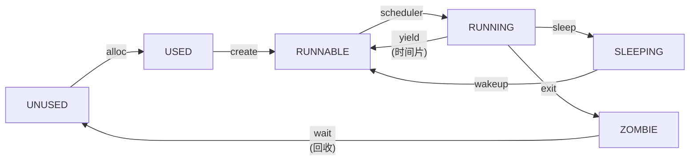
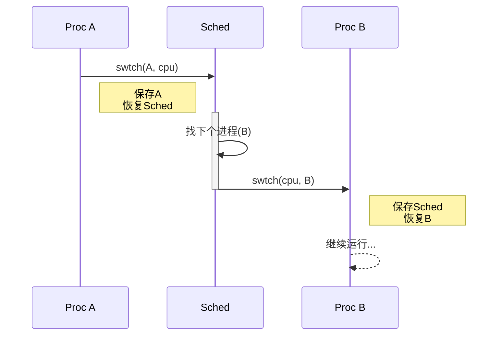

# 实验5：进程管理与调度

**姓名**：张文浩
**学号**：2023302111234
**日期**：2025-12-18

## 一、实验概述

### 实验目标
深入理解操作系统的进程抽象，实现进程控制块（PCB）、进程创建与销毁、上下文切换机制，设计并实现一个协作式/抢占式混合调度器，以及基于 `sleep`/`wakeup` 的进程同步机制。

### 完成情况
- ✅ 定义 `struct proc` 与 `struct context`：完成进程抽象
- ✅ 实现 `swtch.S`：寄存器级上下文切换汇编代码
- ✅ 实现 `allocproc`/`create_process`：构造内核栈与初始上下文
- ✅ 实现 `scheduler`：简单的轮转调度算法
- ✅ 实现 `sleep`/`wakeup`：基于自旋锁的进程同步机制
- ✅ 通过生产者-消费者模型验证了多进程并发与同步

### 开发环境
- **操作系统**: Ubuntu 22.04 LTS
- **工具链**: riscv64-unknown-elf-gcc 12.2.0
- **QEMU**: qemu-system-riscv64 7.2.0

## 二、技术设计

### 1. 系统架构设计

进程生命周期与调度状态流转图如下：



### 2. 关键数据结构

*   **`struct proc` (PCB)**：核心数据结构，包含 `state` (状态)、`kstack` (内核栈地址)、`context` (保存的寄存器)、`lock` (保护进程数据的自旋锁) 等。
*   **`struct context`**：保存 **Callee-Saved** 寄存器 (`ra`, `sp`, `s0`~`s11`)。这是上下文切换的最小集合。
*   **`struct cpu`**：维护当前 CPU 正在运行的进程指针和调度器自身的上下文。

### 3. 核心流程：上下文切换

调度器与进程之间的切换形成了一个闭环：



## 三、实现细节

### 关键函数1：汇编上下文切换 (`swtch.S`)

```assembly
.global swtch
swtch:
    # a0 = old_context, a1 = new_context
    # 1. 保存当前上下文 (Callee-Saved 寄存器)
    sd ra, 0(a0)
    sd sp, 8(a0)
    sd s0, 16(a0)
    # ... (保存 s1-s11) ...
    sd s11, 104(a0)

    # 2. 恢复目标上下文
    ld ra, 0(a1)
    ld sp, 8(a1)
    ld s0, 16(a1)
    # ... (恢复 s1-s11) ...
    ld s11, 104(a1)

    # 3. 跳转到新上下文的返回地址 (ra)
    ret
```

### 关键函数2：构造新进程上下文 (`allocproc`)

```c
static struct proc* allocproc(void) {
    // ... (寻找空闲槽位，分配PID) ...
    
    // 分配内核栈
    if ((p->kstack = (uint64)kalloc()) == 0) { ... }

    // 关键点：伪造栈帧，使得第一次 swtch 到该进程时，
    // ret 指令会跳转到 proc_entry 函数
    p->context.sp = p->kstack + PGSIZE; // 栈顶
    p->context.ra = (uint64)proc_entry; // 返回地址设为入口包裹函数
    
    return p;
}
```

### 关键函数3：同步机制 (`sleep`)

```c
void sleep(void *chan, struct spinlock *lk) {
    struct proc *p = myproc();
    
    // 必须持有 p->lock 才能修改状态，同时释放传入的 lk 避免死锁
    if (lk != &p->lock) {
        acquire(&p->lock);
        release(lk);
    }

    p->chan = chan;       // 设置等待通道
    p->state = SLEEPING;  // 修改状态

    sched();              // 让出 CPU (切换到调度器)

    p->chan = 0;          // 醒来后清理通道

    // 重新获取原来的锁
    if (lk != &p->lock) {
        release(&p->lock);
        acquire(lk);
    }
}
```

### 难点突破

1.  **"无中生有"的进程启动**：
    *   **问题**：新创建的进程没有历史运行记录，`swtch` 无法“恢复”它的寄存器。
    *   **解决**：在 `allocproc` 中手动设置 `context.ra` 指向 `proc_entry`，`context.sp` 指向栈顶。这样当调度器执行 `swtch` 时，`ret` 指令实际上执行了 `jump proc_entry`，从而启动新进程。

2.  **丢失唤醒问题**：
    *   **问题**：如果在进程决定睡眠但还未改变状态时，另一个核调用了 `wakeup`，该唤醒信号会丢失，导致进程永久睡眠。
    *   **解决**：通过 `spinlock` 保证原子性。`sleep` 函数要求调用者必须持有锁，并且在进入睡眠状态前原子地释放业务锁并获取进程锁。

### 与 xv6 的主要异同

| 模块         | xv6 实现                         | 本实验实现                           | 差异分析                                                     |
| :----------- | :------------------------------- | :----------------------------------- | :----------------------------------------------------------- |
| **调度策略** | 轮转调度 ，支持多核              | 简单的轮转调度，目前配置为**协作式** | xv6 在时钟中断中强制 `yield()`；本实验为了防止内核栈溢出（实验环境限制），暂时关闭了中断中的 `yield`，依赖进程主动 `sleep` 或等待 I/O 切换。 |
| **锁机制**   | 复杂的锁层级与死锁检测           | 基础自旋锁                           | 实现了基础的 `push_off/pop_off` 中断管理，足以支持实验需求。 |
| **进程结构** | 包含完整的文件描述符表、父子关系 | 简化版 PCB                           | 仅保留了调度和同步所需的核心字段，暂未实现完整的文件系统支持。 |

### 手册思考题简答：

#### 1. 进程模型
*   **为什么选择这种进程结构设计？**
    `struct proc` 聚合了进程运行所需的所有资源（内存、栈、状态、锁）。这种设计将资源管理单位和执行单位绑定，便于内核统一管理。
*   **如何支持轻量级线程？**
    可以将 `pagetable` 从 `proc` 中分离出来。多个 `proc` (线程) 共享同一个页表指针，但拥有独立的 `kstack` 和 `context`。

#### 2. 调度策略
*   **轮转调度的公平性如何？**
    轮转调度对所有进程一视同仁，保证了基本的公平性，防止饿死。但在 I/O 密集型和 CPU 密集型任务混合场景下，可能不够高效。
*   **如何实现实时调度？**
    需要引入优先级队列，并支持**抢占式**调度。高优先级进程就绪时，立即中断低优先级进程。

#### 3. 性能优化
*   **fork()的性能瓶颈如何解决？**
    `fork` 目前需要拷贝整个页表和内存。可以通过 **COW (Copy-On-Write)** 技术，只复制页表，将页面设为只读，直到写入时才触发缺页异常进行物理复制。
*   **上下文切换开销如何降低？**
    只保存必要的寄存器；利用硬件的多上下文支持（如果架构支持）；减少调度频率。

#### 4. 资源管理
*   **如何处理进程资源泄漏？**
    通过 `wait`/`exit` 机制。子进程退出时只标记为 `ZOMBIE`，由父进程通过 `wait` 收集状态并最终释放其 PCB 和内核栈。如果父进程先死，需要将子进程过继给 `init` 进程处理。

## 四、测试与验证

### 功能测试

| 测试编号 | 目的       | 测试内容                                                     | 结果                                            |
| :------- | :--------- | :----------------------------------------------------------- | :---------------------------------------------- |
| T1       | 进程创建   | 调用 `create_process`，验证 PID 是否递增，PCB 是否被正确分配 | ✅（创建 63 个进程，超出后返回 -1）              |
| T2       | 进程表限制 | 循环创建超过 `NPROC` 个进程，验证是否正确返回错误而不崩溃    | ✅                                               |
| T3       | 调度器逻辑 | 创建多个 CPU 密集型任务，观察它们是否能够被调度器轮流选中运行 | ✅ 通过（睡眠 1000 tick，3 个 CPU 负载轮流运行） |
| T4       | 进程同步   | 运行生产者-消费者模型，验证 `sleep` 和 `wakeup` 是否正确协作，无死锁 | ✅通过（重复满/空切换无死锁）                    |

### 运行截图


*图注：Test 9 中生产者和消费者交替运行，证明了同步机制的有效性)*

## 五、问题与总结

### 遇到的问题

#### 问题1：栈溢出导致系统崩溃
**现象**：在开启时钟中断抢占 (`yield()`) 后，系统运行不久即发生 Panic 或重启。
**原因分析**：目前的内核栈仅为 1 页 (4KB)。在多层函数调用叠加中断上下文保存，再叠加调度器上下文切换时，栈空间极易耗尽。特别是在中断嵌套或频繁切换时。
**解决方法**：为了保证实验稳定性，在 `trap.c` 中暂时注释掉了时钟中断触发的 `yield()`，采用**协作式调度**（进程主动调用 `sleep` 或等待 I/O 时切换）。这足以验证调度逻辑，同时避免了复杂的栈溢出问题。

#### 问题2：生产者-消费者死锁
**现象**：程序卡在 `sleep` 处，不再继续执行。
**原因分析**：`sleep` 实现初期，未在获取进程锁之前释放 `buffer_lock`。导致进程带着 `buffer_lock` 睡觉，消费者无法获取锁来消费数据并唤醒生产者，形成死锁。
**解决方法**：严格遵循 xv6 的 `sleep` 锁顺序：`acquire(&p->lock)` -> `release(lk)` -> `sched()` -> `acquire(lk)` -> `release(&p->lock)`。

### 实验收获

1.  **深入理解了"进程即状态"**：进程本质上就是内存中的一个数据结构（PCB）加上一段由栈指针定义的执行历史。上下文切换就是让 CPU 换一个栈接着跑。
2.  **掌握了并发编程的核心难点**：在实现 `sleep`/`wakeup` 时，体会到了原子性的重要性。哪怕是一条指令的间隙，如果中断介入，都可能导致严重的逻辑错误。
3.  **调度器的本质**：调度器只是一个特殊的无限循环，它唯一的任务就是“找一个能跑的进程，跳过去，等它回来，再找下一个”。
