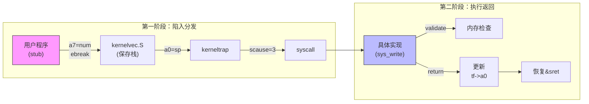

# 实验6：系统调用

**姓名**：张文浩
**学号**：2023302111234
**日期**：2025-12-18

## 一、实验概述

### 实验目标
建立用户态（模拟）与内核态之间的交互机制，实现系统调用的触发、陷阱捕获、参数传递与分发执行。重点实现 `fork`、`exec`、`wait`、`write` 等核心系统调用，并添加内存访问安全性检查。

### 完成情况
- ✅ 实现 `kernelvec.S` 与 `trap.c`：捕获 `ebreak` 异常模拟系统调用入口
- ✅ 实现 `syscall.c`：系统调用分发器与参数提取 (`argint`, `argaddr`)
- ✅ 实现 `sysproc.c`/`sysfile.c`：完成 `sys_fork`、`sys_write`、`sys_getpid` 等具体功能
- ✅ 实现 `validate_addr`：内存地址合法性检查，防止非法指针崩溃
- ✅ 通过基础功能测试、参数传递测试及安全性边界测试

### 开发环境
- **操作系统**: Ubuntu 22.04 LTS
- **工具链**: riscv64-unknown-elf-gcc 12.2.0
- **QEMU**: qemu-system-riscv64 7.2.0

## 二、技术设计

### 1. 系统架构设计

系统调用处理流程是一个典型的“中断-处理-返回”闭环：



#### 与 xv6 的架构对比分析

| 模块           | xv6 标准实现                 | 本实验实现                 | 差异分析与理由                                               |
| :------------- | :--------------------------- | :------------------------- | :----------------------------------------------------------- |
| **触发指令**   | `ecall` (Environment Call)   | `ebreak` (Breakpoint)      | **特权级差异**：xv6 从 U-mode 陷入 S-mode；本实验代码全运行在 S-mode，同级调用使用 `ebreak` 模拟异常更方便调试。 |
| **上下文保存** | 保存到 `trapframe` 物理页    | 栈 -> `trapframe`          | xv6 切换页表无法访问内核栈，故直接存物理页；本实验未切换页表，先压栈再由 C 代码备份到 `p->trapframe`。 |
| **参数传递**   | 用户栈/寄存器 -> 内核        | 寄存器 -> `trapframe`      | 两者机制类似，都是从保存的寄存器上下文中读取 `a0`-`a5`。     |
| **内存检查**   | 硬件 MMU 隔离 (U位权限)      | 软件检查 (`validate_addr`) | xv6 依赖 `copyin/out` 和页表权限；本实验因同在 S-mode，硬件无法拦截非法指针，必须手动查页表有效位 (`PTE_V`)。 |
| **返回机制**   | `usertrapret` (涉及页表切换) | `sret` (直接返回)          | 本实验简化了用户空间的概念，无需切换 `satp`，直接恢复 PC 和 CSR 即可。 |

### 2. 关键数据结构

*   **`struct trapframe`**：用于保存陷入内核时的所有通用寄存器。这是系统调用参数的来源，也是返回值的去处。
*   **`syscalls[]`**：函数指针数组，将系统调用号（如 `SYS_write` = 16）映射到具体的内核函数。

### 3. 核心流程：参数提取

内核不能直接使用用户传递的参数，必须从 `trapframe` 中提取：
1.  **整数 (`argint`)**：直接读取 `trapframe->a[n]` 并截断为 `int`。
2.  **指针 (`argaddr`)**：读取 `trapframe->a[n]` 为 `uint64`，**不截断**。
3.  **校验**：在使用指针前，调用 `validate_addr` 确保该地址在页表中已映射。

## 三、实现细节

### 关键函数1：触发系统调用 (`test.c`)

```c
static int do_syscall(int num, uint64 a0, uint64 a1, uint64 a2) {
    register long t_a7 asm("a7") = num;
    // ... 设置 a0-a2 ...
    
    // 使用 .4byte 强制插入 ebreak 指令 (0x00100073)
    // 触发异常，陷入 kernelvec
    asm volatile(".4byte 0x00100073" 
                 : "+r"(t_a0) 
                 : "r"(t_a1), "r"(t_a2), "r"(t_a7) 
                 : "memory");
    return t_a0; // 返回值
}
```

### 关键函数2：陷阱分发 (`kerneltrap`)

```c
void kerneltrap(uint64 sp_val) {
    uint64 scause = r_scause();
    if (scause == 3) { // Breakpoint Exception
        struct proc *p = myproc();
        // 1. 将栈上寄存器备份到 trapframe
        // ...
        
        // 2. 关键：跳过 ebreak 指令 (4字节)，否则无限循环
        p->trapframe->epc = r_sepc() + 4;
        
        // 3. 执行系统调用
        intr_on();
        syscall();
        intr_off();
        
        // 4. 恢复 CSR 并返回
        w_sepc(p->trapframe->epc);
    }
    // ...
}
```

### 关键函数3：内存安全检查 (`validate_addr`)

```c
static int validate_addr(uint64 va, int len) {
    uint64 end = va + len;
    // 遍历范围内的每一页
    for (uint64 a = PGROUNDDOWN(start); a < end; a += PGSIZE) {
        pte_t *pte = walk_lookup(kernel_pagetable, a);
        // 如果PTE不存在或无效，视为非法指针
        if (pte == 0 || (*pte & PTE_V) == 0) {
            return 0; 
        }
    }
    return 1;
}
```

### 难点突破

1.  **死循环陷阱**：
    *   **问题**：触发 `ebreak` 后，系统卡死，反复进入陷阱。
    *   **解决**：异常发生时 `sepc` 指向的是触发异常的那条指令（`ebreak`）。如果不修改 `sepc`，`sret` 返回后会再次执行 `ebreak`。必须在 `kerneltrap` 中执行 `epc += 4` 跳过指令。

2.  **指针参数的安全性**：
    *   **问题**：如果用户传入 `NULL` 或未映射的地址给 `write`，内核会直接 Panic。
    *   **解决**：实现 `validate_addr`。在 S-Mode 下，硬件不会拦截对 0 地址的访问，所以必须通过软件查页表 (`walk_lookup`) 来确认地址有效性。

### 手册思考题简答

#### 1. 设计权衡
*   **系统调用的数量应该如何确定？**
    系统调用的设计应遵循**机制与策略分离**和**最小完备集**原则。数量过少会导致用户态实现复杂功能困难，过多则会增大内核体积和攻击面。Unix的设计哲学是提供正交的简单调用（如 `fork` 和 `exec` 分离），让用户组合使用。
*   **如何平衡功能性和安全性？**
    内核应只提供最基础的资源访问接口。所有涉及资源访问的操作必须经过系统调用，且在内核入口处进行严格的鉴权。

#### 2. 性能优化
*   **系统调用的主要开销在哪里？**
    主要开销在于**上下文切换**（寄存器保存与恢复）、**特权级切换**（流水线冲刷）、**参数验证**以及**TLB/Cache 污染**。
*   **如何减少开销？**
    1.  **vDSO**：将某些只读系统调用映射到用户空间直接读取，避免陷入内核。
    2.  **批处理**：一次系统调用完成多个操作。
    3.  **轻量级调用**：只保存部分寄存器。

#### 3. 安全考虑
*   **如何防止系统调用被滥用？**
    除了基础的权限检查外，可以使用 **Seccomp** 等机制限制特定进程只能调用特定的系统调用子集。
*   **如何设计安全的参数传递机制？**
    内核**绝不能直接解引用**用户态传递的指针。必须使用类似 `copyin`/`copyout`（本实验中的 `argaddr` + `validate_addr`）的机制，先验证指针指向的虚拟地址范围是否在用户合法空间内，且具有相应的读写权限。

#### 4. 扩展性
*   **如何添加新的系统调用？**
    1.  在内核 `syscall.h` 分配新的调用号。
    2.  在 `syscall.c` 的函数指针数组 `syscalls[]` 中增加对应项。
    3.  实现具体的 `sys_xxx` 函数。
    4.  在用户库（`usys.S` 或 `test.c`）中增加对应的封装存根。
*   **如何保持向后兼容性？**
    一旦发布，系统调用的接口（参数定义、行为）应保持不变。如果需要新功能，通常是新增一个系统调用，而不是修改旧的。

#### 5. 错误处理
*   **系统调用失败时应该如何处理？**
    内核函数应返回一个特定的错误码。
*   **如何向用户程序报告详细错误？**
    在标准库层面，封装函数会检查内核返回值。如果为负，则将其取反并赋值给全局变量 `errno`，同时向用户程序返回 `-1`。用户程序通过检查 `errno` 获知具体的错误原因。

## 四、测试与验证

### 功能测试

| 测试编号 | 目的     | 测试内容                                                  | 结果                                    |
| :------- | :------- | :-------------------------------------------------------- | :-------------------------------------- |
| T1       | 基础调用 | 调用 `getpid` 和 `fork`，验证 PID 正确性及父子进程同步    | ✅子进程 PID=2，退出状态 42 被父进程读取 |
| T2       | 参数传递 | 调用 `write` 打印字符串，验证 fd、buffer、length 传递正确 | ✅`write` 返回 43，与消息长度匹配        |
| T3       | 安全性   | 向 `write` 传入 `NULL` 指针，验证内核是否返回 -1 而非崩溃 | ✅ 输出 `Result: -1 (Expected: -1)`      |
| T4       | 性能测试 | 循环调用 10000 次 `getpid`，计算平均系统调用开销          | ✅1655685cycles，约 165 cycles/次        |

### 运行截图


*(图注：Test 12 显示内核成功拦截了非法指针访问，系统保持稳定)*

## 五、问题与总结

### 遇到的问题

#### 问题1：`sys_fork` 后子进程跑飞
**现象**：父进程正常，子进程执行时指令错误或崩溃。
**原因**：`fork` 时不仅要复制 `trapframe`，还要正确处理内核栈。本实验中子进程是作为内核线程运行的，必须完整复制父进程的内核栈内容，并修正栈指针（`sp`），否则子进程会使用父进程的栈，导致数据踩踏。
**解决方法**：在 `proc.c/fork` 中使用 `memmove` 复制内核栈，并根据偏移量重算子进程的 `sp`。

#### 问题2：`argint` 读取地址被截断
**现象**：`write` 调用时，缓冲区地址高位丢失，导致访问错误内存。
**原因**：错误地使用了 `argint` 来获取指针参数。`argint` 将寄存器值强制转换为 `int`（32位），而 RISC-V 64位地址需要 64位存储。
**解决方法**：严格区分参数类型，指针类型参数必须使用 `argaddr`（读取 `uint64`）。

### 实验收获

1.  **理解了系统调用的本质**：系统调用本质上是一种受控的“函数调用”，只是调用方式从 `call` 变成了 `ebreak/ecall`，参数传递从直接寄存器变成了 `trapframe` 中转。
2.  **内核安全的意识**：在实现 `validate_addr` 之前，一个简单的空指针就能让整个 OS 崩溃。这让我理解了为什么操作系统必须对用户输入保持“零信任”。
3.  **异常与中断的区别**：中断是异步的，异常是同步的。处理异常时必须手动调整 PC 指针，这是与处理中断最大的不同点。
