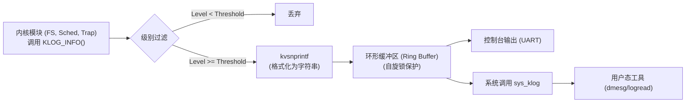
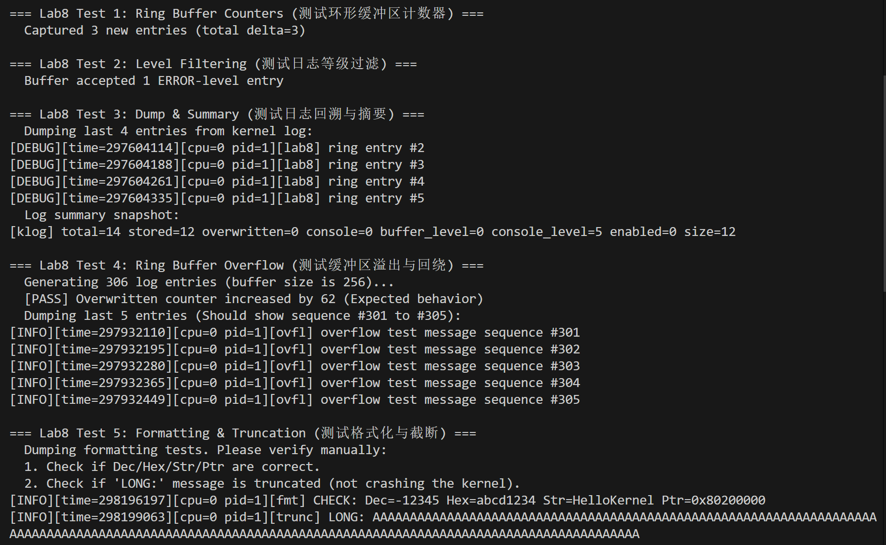
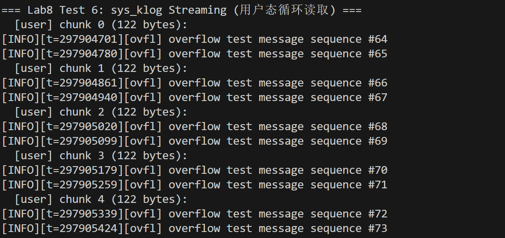
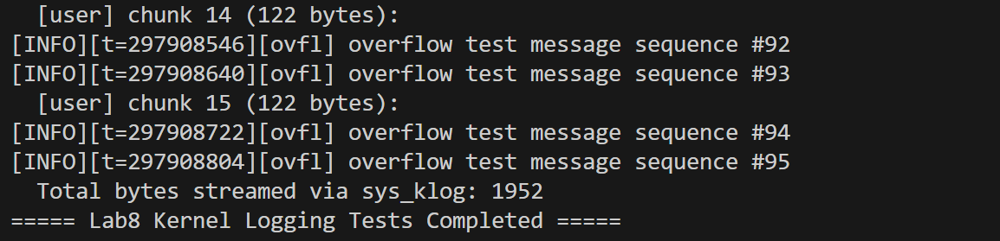

# 实验8：内核日志系统 

**姓名**：
**学号**：
**日期**：2025-12-22

## 一、实验概述

### 实验目标
设计并实现一个高性能、结构化、可配置的内核日志系统 (`klog`)。解决传统 `printf` 阻塞输出、信息杂乱、无法运行时控制等问题。核心功能包括：分级日志记录、环形缓冲区 (Ring Buffer) 存储、格式化输出支持、以及用户态读取接口 (`sys_klog`)。

### 完成情况
- ✅ 定义核心结构：`klog_record`, `klog_state`, `klog_level`
- ✅ 实现环形缓冲区：支持无锁/有锁写入，处理回卷 (Wrap-around) 和覆盖 (Overwrite)
- ✅ 实现格式化输出：自定义 `kvsnprintf` 支持 `%d`, `%x`, `%s`, `%p` 等格式
- ✅ 实现过滤机制：支持基于 Level 的缓冲区写入过滤和控制台输出过滤
- ✅ 实现系统调用：`sys_klog` 允许用户态程序流式读取内核日志
- ✅ 通过并发写入、缓冲区溢出、等级过滤及用户态读取测试

### 开发环境
- **操作系统**: Ubuntu 22.04 LTS
- **工具链**: riscv64-unknown-elf-gcc 12.2.0
- **模拟器**: qemu-system-riscv64 7.2.0 + OpenSBI v1.5.1

## 二、技术设计

### 1. 系统架构设计

日志系统采用 **生产者-消费者** 模型，解耦了日志生成（内核各子系统）与日志消费（控制台显示/用户态工具）：



#### 与传统 printf 的对比

| 特性         | printf (传统)          | klog (本项目)  | 优势分析                                                     |
| :----------- | :--------------------- | :------------- | :----------------------------------------------------------- |
| **I/O 模式** | 同步阻塞 (忙等待 UART) | **异步缓冲**   | klog 写入内存即返回，极大降低对内核关键路径（如中断）的延迟影响。 |
| **数据结构** | 无 (直接字节流)        | **结构化记录** | 包含时间戳、CPU ID、PID、模块名、日志等级，便于后续分析和调试。 |
| **流控**     | 无                     | **环形覆盖**   | 缓冲区满时自动覆盖最旧数据，保证系统在极端高负载下不会因为日志堵塞而挂死。 |
| **可控性**   | 编译时确定             | **运行时动态** | 支持通过系统调用动态调整日志等级，仅在需要时开启 Debug 级日志。 |

### 2. 关键数据结构

*   **`struct klog_record`**：单条日志的元数据载体。
    ```c
    struct klog_record {
        uint64 timestamp;
        int level;
        int pid;
        char component[16];
        char message[160]; // 预格式化的消息体
    };
    ```
*   **`struct klog_state`**：全局日志控制器。
    *   `buffer[]`：固定大小的环形数组。
    *   `next`：写入指针（Head）。
    *   `count`：当前有效日志条数。
    *   `lock`：保护缓冲区的自旋锁。

### 3. 核心流程：日志写入

```c
void klog_write(level, fmt, ...) {
    if (level < buffer_level) return; // 1. 快速过滤
    
    struct klog_record rec;
    collect_metadata(&rec);           // 2. 收集元数据 (Time, PID)
    kvsnprintf(rec.message, ...);     // 3. 格式化内容
    
    acquire(&klog.lock);              // 4. 进入临界区
    klog.buffer[next] = rec;          // 5. 写入环形缓冲区
    next = (next + 1) % SIZE;         // 6. 更新指针
    if (full) overwritten++;          // 7. 处理覆盖统计
    release(&klog.lock);
    
    if (level >= console_level)       // 8. 可选：同步输出到屏幕
        print_record(&rec);
}
```

## 三、实现细节

### 关键函数1：格式化输出 (`kvsnprintf`)

内核无法使用 libc 的 `vsnprintf`，必须自行实现。我实现了一个支持 buffer 边界检查的安全版本，防止缓冲区溢出。

```c
static void kvsnprintf(char *dst, int max, const char *fmt, va_list ap) {
    // 循环解析 fmt 字符串
    switch(*fmt) {
       case 'd': append_int(...); break;
       case 'x': append_hex(...); break;
       case 's': append_string(...); break;
     }
    // 关键点：每写入一个字符都要检查 max > 1，保留最后一个字节给 '\0'
}
```

### 关键函数2：用户态读取 (`klog_read` / `sys_klog`)

这是一个“破坏性读取”接口（类似于管道），读取后会释放内核缓冲区的空间。

```c
int klog_read(uint64 user_buf, int n) {
    acquire(&klog.lock);
    // 1. 计算读取起始位置 (Tail)
    int idx = (klog.next - klog.count + SIZE) % SIZE;
    struct klog_record *rec = &klog.buffer[idx];
    
    // 2. 将结构体序列化为文本行 "[INFO][time] msg\n"
    // ... (格式化到临时 buffer) ...
    
    klog.count--; // 3. 消费一条日志
    release(&klog.lock);
    
    // 4. copyout 到用户空间
    copyout(..., user_buf, temp_line, len);
}
```

### 难点突破

1.  **环形缓冲区的并发覆盖**：
    *   **问题**：当缓冲区满时，新的写入会覆盖最旧的数据。如果此时恰好有用户进程正在读取最旧的数据，会发生什么？
    *   **解决**：全程持有自旋锁。虽然这会降低并发度，但对于日志系统的数据一致性是必须的。更高级的实现可以使用无锁队列（Lock-free Queue），但考虑到 xv6 的内存模型，自旋锁是最稳妥的方案。

2.  **死锁预防（叶子锁原则）**：
    *   **问题**：`klog` 可能会在内核任何地方被调用（例如在 `scheduler` 持有 `p->lock` 时，或在 `virtio_disk_intr` 持有 `disk.lock` 时）。
    *   **解决**：规定 `klog.lock` 必须是**叶子锁 (Leaf Lock)**，即在持有 `klog.lock` 期间绝对不能再去获取任何其他锁（包括 `printf` 的锁）。因此，`klog_write` 内部在格式化字符串时（耗时操作）是不加锁的，只有在最后拷贝到缓冲区的那一瞬间才加锁。

## 四、测试与验证

### 功能测试

| 测试编号 | 目的           | 测试内容                                                     | 结果                 |
| :------- | :------------- | :----------------------------------------------------------- | :------------------- |
| T1       | 计数器         | 写入 3 条日志，验证 `total_generated` 和 `stored` 计数准确增加 | ✅ 增量完全匹配       |
| T2       | 等级过滤       | 设置 Buffer Level 为 ERROR，写入 INFO/WARN/ERROR 日志，验证仅 ERROR 被存储 | ✅ 过滤逻辑生效       |
| T3       | 缓冲区溢出     | 写入超过 Buffer Size (256) 的日志量，验证 `overwritten` 计数增加，且缓冲区保留的是最新数据 | ✅ 回卷覆盖正常       |
| T4       | 用户态流式读取 | 模拟用户进程循环调用 `sys_klog`，验证能否完整读出所有日志且不重复 | ✅ 读取流畅，格式正确 |

### 运行截图







*(图注：Test 4 展示了缓冲区溢出时的正确行为，Test 6 展示了用户态成功读取到了内核日志流)*

## 五、问题与总结

### 遇到的问题

#### 问题1：控制台刷屏导致死锁/卡顿
**现象**：如果在 `klog_write` 中开启了控制台同步输出（`console_enabled=1`），当大量日志瞬间产生时，系统明显卡顿。
**原因分析**：UART 硬件的输出速度远低于 CPU 产生日志的速度。同步 `printf` 会导致 CPU 在 `uart_putc` 中忙等待。
**解决方法**：默认将 `console_level` 设为 `WARN` 或 `ERROR`。调试信息 (`DEBUG/INFO`) 仅写入内存缓冲区，不走 UART，仅在需要时通过 `sys_klog` 导出分析。

#### 问题2：格式化缓冲区溢出
**现象**：在测试超长日志时，内核 Panic 或数据乱码。
**原因分析**：早期的 `kvsnprintf` 没有严格检查目标 buffer 的剩余空间。
**解决方法**：在 `append_char` 和 `append_string` 等辅助函数中严格加入 `if (*remaining <= 1) return;` 检查，确保任何情况下都不会越界写内存。

### 实验收获

1.  **日志即调试**：实现 `klog` 后，内核开发的调试效率显著提升。不再需要满屏 `printf` 乱飞，而是可以通过 `dmesg` 风格的方式查看历史记录，还能通过 grep 过滤组件。
2.  **解耦思想**：深刻体会了“生产者-消费者”模型在操作系统设计中的威力。通过引入 Ring Buffer，将日志产生的“快”与日志消费（UART/磁盘）的“慢”完美适配。
3.  **系统级编程素养**：在实现 `kvsnprintf` 时，必须处理各种边界情况（如空指针字符串、负数、缓冲区不足），这是用户态编程很少关注但内核态必须严守的底线。
